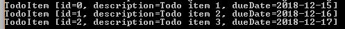

# 자바 패키지 가이드

## 1. 개요
이 빠른 자습서에서는 Java 패키지의 기본 사항을 다룹니다.
패키지를 만들고 그 안에 배치한 유형에 액세스하는 방법을 살펴보겠습니다.
우리는 또한 명명 규칙과 그것이 기본 디렉토리 구조와 어떻게 관련되는지 논의할 것입니다.
마지막으로 패키지된 Java 클래스를 컴파일하고 실행할 것입니다.

## 2. 자바 패키지 개요
Java에서는 패키지를 사용하여 관련 클래스, 인터페이스 및 하위 패키지를 그룹화합니다.

이 작업의 주요 이점은 다음과 같습니다.

- 관련 유형을 찾기 쉽게 만들기 – 패키지에는 일반적으로 논리적으로 관련된 유형이 포함됩니다.
- 이름 충돌 방지 – 패키지는 클래스를 고유하게 식별하는 데 도움이 됩니다. 예를 들어 _com.baeldung.Application_ 및 _com.example.Application_ 클래스를 가질 수 있습니다.
- 액세스 제어 – 패키지와 액세스 수정자를 결합하여 유형에 대한 가시성과 액세스를 제어할 수 있습니다.

다음으로 Java 패키지를 만들고 사용하는 방법을 살펴보겠습니다.

## 3. 패키지 생성

패키지를 생성하려면 파일의 첫 번째 코드 줄에 패키지 문을 추가 하여 패키지문을 사용해야 합니다 .
_com.baeldung.packages_ 라는 이름의 패키지에 유형을 배치해 보겠습니다 .

```java
package com.baeldung.packages;
```

각각의 새로운 유형을 패키지에 넣는 것이 좋습니다. 유형을 정의하고 패키지에 넣지 않으면 기본 또는 이름 없는 패키지로 이동합니다.
기본 패키지를 사용하면 몇 가지 단점이 있습니다.

- 패키지 구조의 이점을 상실하고 하위 패키지를 가질 수 없습니다.
- 다른 패키지에서 기본 패키지의 유형을 가져올 수 없습니다.
- protected 및 package-private 액세스 범위는 의미가 없습니다 .

따라서 실제 응용 프로그램에서 이름이 지정되지 않거나 기본 패키지를 사용하지 않아야 합니다.

### 3.1. 명명 규칙

같은 이름의 패키지를 피하기 위해 몇 가지 명명 규칙을 따릅니다.

- 우리는 패키지 이름을 모두 소문자로 정의합니다.
- 패키지 이름은 마침표로 구분됩니다.
- 이름은 또한 이름 을 만든 회사 또는 조직에 의해 결정됩니다.

조직을 기반으로 패키지 이름을 결정하기 위해 일반적으로 회사 URL을 반대로 하여 시작합니다.   
그 후 명명 규칙은 회사에서 정의하며 부서 이름과 프로젝트 이름을 포함할 수 있습니다.

예를 들어, www.baeldung.com 에서 패키지를 만들려면 그것을 반대로 합시다:

> com.baeldung

그런 다음 _com.baeldung.packages_ 또는 *com.baeldung.packages.domain*과 같은 하위 패키지를 추가로 정의할 수 있습니다.

### 3.2. 디렉토리 구조
Java의 패키지는 디렉토리 구조에 해당합니다.

각 패키지와 하위 패키지에는 고유한 디렉토리가 있습니다. 
따라서 _com.baeldung.packages_ 패키지의 경우 com -> baeldung -> packages 의 디렉토리 구조를 가져야 합니다.   

대부분의 IDE는 패키지 이름을 기반으로 이 디렉토리 구조를 만드는 데 도움이 되므로 직접 만들 필요가 없습니다.

## 4. 패키지 멤버 사용하기
domain 이라는 서브패키지에 TodoItem 클래스를 정의하는 것부터 시작합시다.
```java
package com.baeldung.packages.domain;

public class TodoItem {
    private Long id;
    private String description;
    
    // standard getters and setters
}
```

### 4-1. Imports

다른 패키지의 클래스에서 TodoItem 클래스를 사용 하려면 가져와야 합니다. 가져온 후에는 이름으로 액세스할 수 있습니다.   
패키지에서 단일 유형을 가져오거나 별표를 사용하여 패키지의 모든 유형을 가져올 수 있습니다.

전체 도메인 하위 패키지를 가져오겠습니다.

```java 
import com.baeldung.packages.domain.*;
```

이제 TodoItem 클래스만 가져오겠습니다.
```java
import com.baeldung.packages.domain.TodoItem;
```

JDK 및 기타 Java 라이브러리도 자체 패키지와 함께 제공됩니다. 같은 방식으로 프로젝트에서 사용하려는 기존 클래스를 가져올 수 있습니다.   
예를 들어 Java 핵심 List 인터페이스와 ArrayList 클래스를 가져오겠습니다.

```java
import java.util.ArrayList;
import java.util.List;
```

그런 다음 단순히 이름을 사용하여 애플리케이션에서 이러한 유형을 사용할 수 있습니다.

```java
public class TodoList {
    private List<TodoItem> todoItems;

    public void addTodoItem(TodoItem todoItem) {
        if (todoItems == null) {
            todoItems = new ArrayList<TodoItem>();
        }
        todoItems.add(todoItem);
    }
}
```

여기에서 우리는 새로운 클래스를 자바 코어 클래스와 함께 사용하여 ToDoItem 목록 을 생성했습니다.

### 4.2. 정규화된 이름

때로는 다른 패키지에서 같은 이름을 가진 두 개의 클래스를 사용할 수 있습니다.    
예를 들어, 우리는 java.sql.Date 와 java.util.Date 를 모두 사용할 수 있습니다.   
이름 충돌이 발생하면 클래스 중 하나 이상에 대해 완전한 클래스 이름을 사용해야 합니다.

완전한 이름으로 TodoItem 을 사용합시다 :

```java
public class TodoList {
    private List<com.baeldung.packages.domain.TodoItem> todoItems;

    public void addTodoItem(com.baeldung.packages.domain.TodoItem todoItem) {
        if (todoItems == null) {
            todoItems = new ArrayList<com.baeldung.packages.domain.TodoItem>();
        }todoItems.add(todoItem);
    }

    // standard getters and setters
}
```

## 5.  javac로 컴파일하기

패키지된 클래스를 컴파일할 때 디렉터리 구조를 기억해야 합니다. 소스 폴더에서 시작하여 javac 에 파일을 찾을 위치를 알려야 합니다.   
TodoList 클래스가 의존 하기 때문에 먼저 TodoItem 클래스를 컴파일해야 합니다.   

명령줄이나 터미널을 열고 소스 디렉토리로 이동하여 시작하겠습니다.

이제 _com.baeldung.packages.domain.TodoItem_ 클래스를 컴파일해 보겠습니다.

> javac com/baeldung/packages/domain/TodoItem.java

클래스가 깔끔하게 컴파일되면 오류 메시지가 표시되지 않고 TodoItem.class 파일 이 com/baeldung/packages/domain 디렉토리 에 나타나야 합니다.   
다른 패키지의 유형을 참조하는 유형의 경우 -classpath 플래그를 사용 하여 다른 컴파일된 클래스를 찾을 위치를 javac 명령에 알려야 합니다.   
이제 TodoItem 클래스가 컴파일  되었으므로 TodoList 및 TodoApp 클래스를 컴파일할 수 있습니다.

> javac -classpath . com/baeldung/packages/*.java

다시 말하지만, 오류 메시지가 표시되지 않아야 하며 com/baeldung/packages 디렉토리에서 두 개의 클래스 파일을 찾아야 합니다.   

TodoApp 클래스 의 정규화된 이름을 사용하여 애플리케이션을 실행해 보겠습니다 .
> java com.baeldung.packages.TodoApp

출력은 다음과 같아야 합니다

