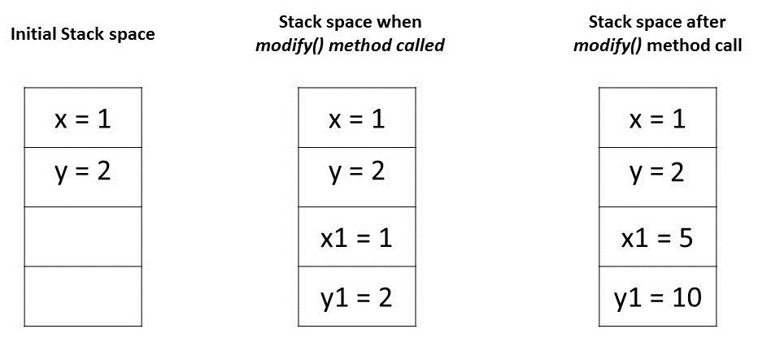
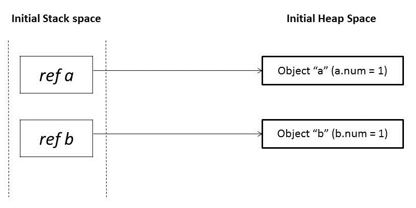
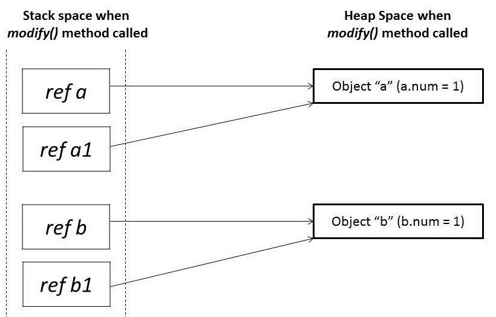
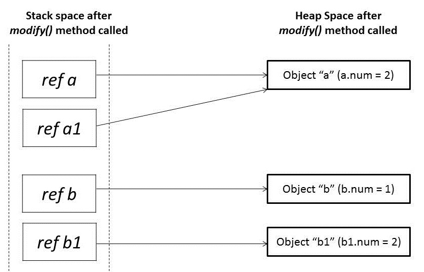

# Java Pass-By-Value as a Parameter Passing

## 1. 소개
메서드에 인수를 전달하는 가장 일반적인 두 가지 모드는 "**값에 의한 전달**"과 "**참조에 의한 전달**"입니다.    
다른 프로그래밍 언어는 이러한 개념을 다른 방식으로 사용합니다. Java에 관한 한 모든 것은 엄격하게 **Pass-by-Value** 입니다.

이 튜토리얼에서는 Java가 다양한 유형에 대한 인수를 전달하는 방법을 설명합니다.

## 2. 값에 의한 전달과 참조에 의한 전달
함수에 매개변수를 전달하는 몇 가지 다른 메커니즘부터 시작하겠습니다.

- 값
- 참조
- 결과
- 가치-결과
- 이름

현대 프로그래밍 언어에서 가장 일반적인 두 가지 메커니즘은 "값별 전달"과 "참조별 전달"입니다.    
계속 진행하기 전에 먼저 다음 사항에 대해 논의해 보겠습니다.

### 2.1. call by value(값으로 전달)
매개변수가 값으로 전달되는 경우 호출자와 호출 수신자 메소드는 서로 복사본인 두 개의 다른 변수에서 작동합니다. 한 변수를 변경해도 다른 변수는 수정되지 않습니다.   
즉, 메서드를 호출하는 동안 호출 대상 메서드에 전달된 매개 변수는 원래 매개 변수의 복제본이 됩니다. 호출 수신자 메소드에서 수행된 수정은 호출자 메소드의 원래 매개변수에 영향을 미치지 않습니다.

### 2.2. call by reference(참조에 의한 전달)
매개변수가 참조에 의한 전달인 경우 호출자와 호출 수신자는 동일한 개체에서 작동합니다.   
변수가 참조로 전달되는 경우 개체의 고유 식별자가 메서드로 전송됨을 의미합니다. **매개변수의 인스턴스 멤버를 변경하면 원래 값이 변경됩니다.**

## 3. 자바에서 매개변수 전달
모든 프로그래밍 언어의 기본 개념은 "값"과 "참조"입니다. Java에서 기본 변수는 실제 값을 저장하는 반면 비 기본 변수는 참조하는 개체의 주소를 가리키는 참조 변수를 저장합니다.    
값과 참조는 모두 **스택 메모리에 저장됩니다**.   

Java의 인수는 항상 값으로 전달됩니다. 메서드를 호출하는 동안 값이든 참조이든 각 인수의 복사본이 스택 메모리에 생성되어 메서드에 전달됩니다.   
프리미티브의 경우 값은 단순히 스택 메모리 내부에 복사된 다음 호출 수신자 메서드에 전달됩니다.   

원시가 아닌 경우 스택 메모리의 참조는 힙에 있는 실제 데이터를 가리킵니다. 객체를 전달할 때 스택 메모리의 참조가 복사되고 새 참조가 메서드에 전달됩니다.   
이제 몇 가지 코드 예제의 도움으로 이것을 실제로 살펴보겠습니다.

### 3.1. 기본 유형 전달
Java 프로그래밍 언어는 8가지 기본 데이터 유형 을 제공 합니다. 원시 변수는 스택 메모리에 직접 저장됩니다. 
원시 데이터 유형의 변수가 인수로 전달될 때마다 실제 매개변수는 형식 인수에 복사되고 이러한 형식 인수는 스택 메모리에 자체 공간을 축적합니다.   

이러한 형식 매개변수의 수명은 해당 메서드가 실행되는 동안에만 지속되며 반환 시 이러한 형식 인수는 스택에서 지워지고 버려집니다.   

코드 예제를 통해 이해해 보겠습니다.
```java
public class PrimitivesUnitTest {
 
    @Test
    public void whenModifyingPrimitives_thenOriginalValuesNotModified() {
        
        int x = 1;
        int y = 2;
       
        // Before Modification
        assertEquals(x, 1);
        assertEquals(y, 2);
        
        modify(x, y);
        
        // After Modification
        assertEquals(x, 1);
        assertEquals(y, 2);
    }
    
    public static void modify(int x1, int y1) {
        x1 = 5;
        y1 = 10;
    }
}
```

이러한 값이 메모리에 저장되는 방식을 분석하여 위 프로그램의 주장을 이해하려고 합시다.

* 메인 메소드 의 변수 " x" 와 " y" 는 원시 타입이며 그 값은 스택 메모리에 직접 저장됩니다.
* modify() 메서드를 호출하면 이러한 각 변수에 대한 정확한 복사본이 생성되어 스택 메모리의 다른 위치에 저장됩니다.
* 이러한 복사본을 수정하면 복사본에만 영향을 미치고 원래 변수는 변경되지 않습니다.



### 3.2. 객체 참조 전달
Java에서 모든 객체는 후드 아래의 힙 공간에 동적으로 저장됩니다. 이러한 개체는 참조 변수라는 참조에서 참조됩니다.   
Primitives와 달리 Java 객체는 두 단계로 저장됩니다. 참조 변수는 스택 메모리에 저장되고 참조하는 객체는 힙 메모리에 저장됩니다.   
개체가 인수로 전달될 때마다 힙 메모리에서 원래 참조 변수와 동일한 개체 위치를 가리키는 참조 변수의 정확한 복사본이 생성됩니다.   
그 결과 메서드에서 동일한 개체를 변경할 때마다 해당 변경 내용이 원래 개체에 반영됩니다. 그러나 전달된 참조 변수에 새 개체를 할당하면 원래 개체에 반영되지 않습니다.   

코드 예제의 도움으로 이것을 이해하려고 노력합시다.
```java
public class NonPrimitivesUnitTest {
 
    @Test
    public void whenModifyingObjects_thenOriginalObjectChanged() {
        Foo a = new Foo(1);
        Foo b = new Foo(1);

        // Before Modification
        assertEquals(a.num, 1);
        assertEquals(b.num, 1);
        
        modify(a, b);
        
        // After Modification
        assertEquals(a.num, 2);
        assertEquals(b.num, 1);
    }
 
    public static void modify(Foo a1, Foo b1) {
        a1.num++;
       
        b1 = new Foo(1);
        b1.num++;
    }
}
 
class Foo {
    public int num;
   
    public Foo(int num) {
        this.num = num;
    }
}
```

위의 프로그램에서 주장을 분석해 봅시다. 동일한 값  1 을 갖는 modify()  메소드  에서  객체  a  와  b 를 전달 했습니다. 처음에 이러한 개체 참조는 힙 공간에서 두 개의 개별 개체 위치를 가리킵니다.


이러한 참조 a  및  b 가  modify() 메서드에 전달 되면 동일한 이전 객체를 가리키는 참조 a1 및  b1 의 미러 복사본이 생성 됩니다.


modify()  메서드에서 참조 a1 을 수정  하면  원래 객체가 변경됩니다. 그러나 참조  b1에  대해 새 개체를 할당했습니다. 따라서 이제 힙 메모리의 새 개체를 가리키고 있습니다.   
b1 에 대한 모든 변경 사항은  원래 개체의 어떤 것도 반영하지 않습니다.


