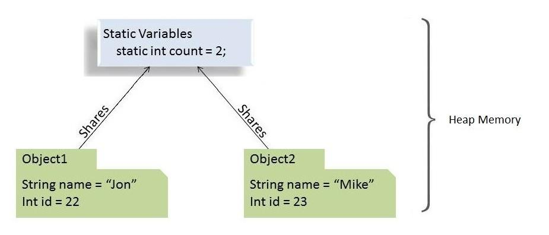

> 원문 : https://www.baeldung.com/java-static

# static 키워드

## 1. 개요
이 자습서에서는 Java 언어 의 static 키워드를 자세히 살펴봅니다.

변수, 메서드, 블록 및 중첩 클래스에 static 키워드를 적용하는 방법과 이것이 어떤 차이를 만드는지 알아보겠습니다.

## 2. static 키워드 의 구조

Java 프로그래밍 언어 에서 키워드 **static 은 특정 멤버가 해당 유형의 인스턴스가 아니라 유형 자체에 속한다는 것을 의미합니다**.

즉, **클래스의 모든 인스턴스에서 공유되는 해당 static 멤버의 인스턴스를 하나만 생성합니다**.



변수, 메서드, 블록 및 중첩 클래스에 키워드를 적용할 수 있습니다.

## 3. static 필드(또는 클래스 변수)

Java에서 static 필드를 선언하면 해당 필드의 정확히 단일 복사본이 생성되고 해당 클래스의 모든 인스턴스에서 공유됩니다.

클래스를 초기화하는 횟수는 중요하지 않습니다. 그것에 속하는 static 필드 의 복사본은 항상 하나만 있습니다. 이 static 필드의 값은 동일하거나 다른 클래스의 모든 개체에서 공유됩니다.

메모리 관점에서 static 변수는 힙 메모리에 저장됩니다.

### 3.1. static 필드 의 예

여러 속성(인스턴스 변수) 이 있는 Car 클래스 가 있다고 가정해 보겠습니다.

이 Car 청사진 에서 새 객체를 초기화할 때마다 각각의 새 객체에는 이러한 인스턴스 변수의 고유한 복사본이 있습니다.

그러나 초기화된 Car 개체 의 수를 보유하고 모든 인스턴스에서 공유되는 변수를 원한다고 가정해 보겠습니다.

이것이 static 변수가 들어오는 곳입니다.

```java
public class Car {
    private String name;
    private String engine;
    
    public static int numberOfCars;
    
    public Car(String name, String engine) {
        this.name = name;
        this.engine = engine;
        numberOfCars++;
    }

    // getters and setters
}
```

이제 초기화하는 이 클래스의 모든 개체에 대해 numberOfCars 변수의 동일한 복사본이 증가합니다.

따라서 이 경우 다음이 사실이 됩니다.

```java
@Test
public void whenNumberOfCarObjectsInitialized_thenStaticCounterIncreases() {
    new Car("Jaguar", "V8");
    new Car("Bugatti", "W16");
 
    assertEquals(2, Car.numberOfCars);
}
```

### 3.2. static 필드를 사용해야 하는 이유

- 변수의 값이 객체와 무관할 때
- 값이 모든 개체에서 공유되어야 하는 경우

### 3.3. 기억해야 할 핵심 사항

- static 변수는 클래스에 속하므로 클래스 이름을 사용하여 직접 액세스할 수 있습니다. 따라서 객체 참조가 필요하지 않습니다.
- 클래스 수준에서 static 변수만 선언할 수 있습니다.
- 객체 초기화 없이 static 필드에 액세스할 수 있습니다.
- 마지막으로 객체 참조(예: ford.numberOfCars++ )를 사용하여 static 필드에 액세스할 수 있습니다. 그러나 이것이 인스턴스 변수인지 클래스 변수인지 파악하기 어려워지기 때문에 이것을 피해야 합니다. 대신 클래스 이름( Car.numberOfCars++ )을 사용하여 항상 static 변수를 참조해야 합니다 .

## 4. static 메서드(또는 클래스 메서드)

static 필드와 마찬가지로 static 메서드도 개체 대신 클래스에 속합니다. 따라서 그들이 상주하는 클래스의 객체를 생성하지 않고 호출할 수 있습니다.

### 4.1. static 메서드 의 예

우리는 일반적으로 인스턴스 생성에 의존하지 않는 작업을 수행하기 위해 static 메서드를 사용합니다.

해당 클래스의 모든 인스턴스에서 코드를 공유하기 위해 static 메서드에 해당 코드를 작성합니다.

```java
public static void setNumberOfCars(int numberOfCars) {
    Car.numberOfCars = numberOfCars;
}
```

또한 일반적으로 static 메서드를 사용하여 유틸리티 또는 도우미 클래스를 만들어 이러한 클래스의 새 개체를 만들지 않고도 가져올 수 있습니다.

JDK의 Collections 또는 Math 유틸리티 클래스, Apache 의 StringUtils 또는 Spring 프레임워크의 CollectionUtils 를 살펴보고 모든 메소드가 static 임을 확인하십시오.

### 4.2. static 메서드 를 사용해야 하는 이유

- 객체에 의존하지 않는 static 변수 및 기타 static 메서드에 액세스/조작하려면
- static 메서드는 유틸리티 및 헬퍼 클래스에서 널리 사용됩니다.

### 4.3. 기억해야 할 핵심 사항
- Java의 static 메소드는 **컴파일 시간에 해결됩니다**. 메서드 재정의는 런타임 다형성의 일부이므로 static 메서드는 재정의할 수 없습니다.
- 추상 메서드는 static일 수 없습니다.
- static 메서드는 this 또는 super 키워드를 사용할 수 없습니다.
- 인스턴스, 클래스 메서드 및 변수의 다음 조합이 유효합니다.
  - 인스턴스 메소드는 인스턴스 메소드와 인스턴스 변수 모두에 직접 액세스할 수 있습니다.
  - 인스턴스 메서드는 static 변수와 static 메서드에 직접 액세스할 수도 있습니다.
  - static 메서드는 모든 static 변수 및 기타 static 메서드에 액세스할 수 있습니다.
  - static 메서드는 인스턴스 변수와 인스턴스 메서드에 직접 액세스할 수 없습니다. 그렇게 하려면 일부 개체 참조가 필요합니다.

## 5. static 블록
static 변수 를 초기화하기 위해 static 블록을 사용 합니다. 선언하는 동안 static 변수를 직접 초기화할 수 있지만 여러 줄 처리를 수행해야 하는 상황이 있습니다.

이러한 경우 static 블록이 유용합니다.

초기화 중에 static 변수에 추가 다중 명령문 논리가 필요한 경우 static 블록을 사용할 수 있습니다.

### 5.1. static 블록 예제

미리 정의된 값으로 목록 개체를 초기화하려고 한다고 가정합니다.

이것은 static 블록을 사용하면 쉬워집니다.

```java
public class StaticBlockDemo {
    public static List<String> ranks = new LinkedList<>();

    static {
        ranks.add("Lieutenant");
        ranks.add("Captain");
        ranks.add("Major");
    }
    
    static {
        ranks.add("Colonel");
        ranks.add("General");
    }
}
```

선언과 함께 모든 초기 값으로 List 개체 를 초기화하는 것은 불가능합니다. 이것이 우리가 여기서 static 블록을 활용한 이유입니다.

### 5.2. static 블록 을 사용해야 하는 이유

- static 변수 의 초기화에 할당을 제외한 몇 가지 추가 논리가 필요한 경우
- static 변수 의 초기화 가 오류가 발생하기 쉽고 예외 처리가 필요한 경우

### 5.3. 기억해야 할 핵심 사항

- 클래스에는 여러 개의 static 블록이 있을 수 있습니다.
- static 필드 및 static 블록은 클래스에 있는 것과 동일한 순서로 확인 및 실행됩니다.

## 6. static 클래스

Java 프로그래밍 언어를 사용하면 클래스 내에서 클래스를 생성할 수 있습니다. 한 곳에서만 사용할 요소를 그룹화하는 강력한 방법을 제공합니다. 이렇게 하면 코드를 보다 체계적이고 읽기 쉽게 유지하는 데 도움이 됩니다.

중첩 클래스 아키텍처는 두 가지로 나뉩니다.

- static 으로 선언한 중첩 클래스를 static 중첩 클래스 라고 합니다.
- static 이 아닌 중첩 클래스를 내부 클래스 라고 합니다.

이 둘의 주요 차이점은 내부 클래스는 바깥쪽 클래스의 모든 멤버(프라이빗 포함)에 액세스할 수 있는 반면 static 중첩 클래스는 외부 클래스의 static 멤버에만 액세스할 수 있다는 것입니다.

사실, static 중첩 클래스는 다른 최상위 클래스와 똑같이 동작하지만 더 나은 패키징 편의성을 제공하기 위해 액세스할 수 있는 유일한 클래스로 둘러싸여 있습니다.

### 6.1. static 클래스 의 예

싱글톤 객체를 생성하기 위해 가장 널리 사용되는 접근 방식은 static 중첩 클래스를 사용하는 것입니다.

```java
public class Singleton {
    private Singleton() {}


    private static class SingletonHolder {
        public static final Singleton instance = new Singleton();
    }
    
    public static Singleton getInstance() {
        return SingletonHolder.instance;
    }
}
```

### 6.2. static inner class 를 사용해야 하는 이유

- 한 곳에서만 사용되는 그룹화 클래스는 캡슐화를 증가시킵니다.
- 우리는 코드를 사용할 유일한 장소에 더 가깝게 코드를 가져옵니다. 이렇게 하면 가독성이 향상되고 코드를 더 쉽게 유지 관리할 수 있습니다.
- 중첩 클래스가 둘러싸는 클래스 인스턴스 멤버에 대한 액세스를 필요로 하지 않는 경우 static 으로 선언하는 것이 좋습니다. 이렇게 하면 외부 클래스에 연결되지 않으므로 **힙이나 스택 메모리가 필요하지 않으므로 더 최적화됩니다**.

### 6.3. 기억해야 할 핵심 사항

- static 중첩 클래스는 바깥쪽 클래스의 인스턴스 멤버에 액세스할 수 없습니다. 개체의 참조를 통해서만 액세스할 수 있습니다.
- static 중첩 클래스는 비공개 클래스를 포함하여 바깥쪽 클래스의 모든 static 멤버에 액세스할 수 있습니다.
- Java 프로그래밍 사양에서는 최상위 클래스를 static 으로 선언할 수 없습니다. 클래스 내의 클래스(중첩 클래스)만 static 으로 만들 수 있습니다 .
