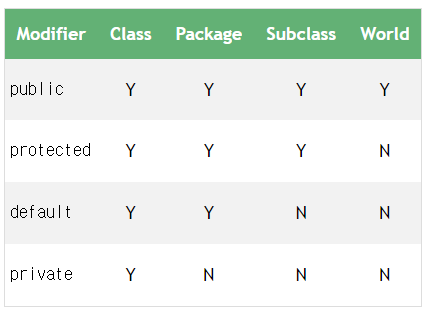

> 원문 : https://www.baeldung.com/java-access-modifiers

# Java의 접근 제어자

## 1. 개요
이 자습서에서는 클래스, 변수, 메서드 및 생성자에 대한 액세스 수준을 설정하는 데 사용되는 Java의 액세스 한정자를 살펴봅니다.

간단히 말해서 public , private , protected 및 default (키워드 없음)의 네 가지 액세스 수정자가 있습니다.

시작하기 전에 최상위 클래스는 공용 또는 기본 액세스 한정자만 사용할 수 있다는 점에 유의합시다. 회원 수준에서는 4가지를 모두 사용할 수 있습니다.

## 2. default
명시적으로 키워드를 사용하지 않으면 Java는 지정된 클래스, 메서드 또는 속성에 대한 기본 액세스를 설정합니다. 
기본 액세스 수정자는 package-private 라고도 하며 , 이는 모든 멤버가 동일한 패키지 내에서 표시 되지만 다른 패키지에서는 액세스할 수 없음을 의미합니다.

```java
package com.baeldung.accessmodifiers;

public class SuperPublic {
    static void defaultMethod() {
        ...
    }
}
```

defaultMethod() 는 동일한 패키지의 다른 클래스에서 액세스할 수 있습니다.

```java
package com.baeldung.accessmodifiers;

public class Public {
    public Public() {
        SuperPublic.defaultMethod(); // Available in the same package.
    }
}
```

그러나 다른 패키지에서는 사용할 수 없습니다

## 3. public
클래스, 메서드 또는 속성에 public 키워드를 추가하면 전역 에서 사용할 수 있게 됩니다.
즉, 모든 패키지의 다른 모든 클래스에서 사용할 수 있습니다. 다음은 가장 제한이 적은 액세스 수정자입니다.
```java
package com.baeldung.accessmodifiers;

public class SuperPublic {
    public static void publicMethod() {
        ...
    }
}
```
publicMethod() 는 다른 패키지에서 사용할 수 있습니다.
```java
package com.baeldung.accessmodifiers.another;

import com.baeldung.accessmodifiers.SuperPublic;

public class AnotherPublic {
    public AnotherPublic() {
        SuperPublic.publicMethod(); // Available everywhere. Let's note different package.
    }
}
```

public 키워드가 클래스, 인터페이스, 중첩된 공용 클래스 또는 인터페이스와 메서드에 적용될 때 작동  하는 방식에 대한 자세한 내용 은 전용 문서 를 참조하십시오.

## 4. private
private 키워드 가 있는 모든 메서드, 속성 또는 생성자  는 동일한 클래스에서만 액세스할 수 있습니다 . 이것은 가장 제한적인 액세스 수정자이며 캡슐화 개념의 핵심입니다. 모든 데이터는 외부 세계에서 숨겨집니다.
```java
package com.baeldung.accessmodifiers;

public class SuperPublic {
    static private void privateMethod() {
        ...
    }
    
     private void anotherPrivateMethod() {
         privateMethod(); // available in the same class only.
    }
}
```

## 5. protected
공개 및 비공개 액세스 수준  사이 에는 보호된 액세스 수정자가 있습니다.

protected 키워드를 사용하여 메서드, 속성 또는 생성자를 선언 하면 동일한 패키지(패키지 개인 액세스 수준에서와 같이)에서 멤버에 액세스할 수 있으며, 다른 패키지에 있더라도 해당 클래스의 모든 하위 클래스에서 추가 로 멤버에 액세스할 수 있습니다.
```java
package com.baeldung.accessmodifiers;

public class SuperPublic {
    static protected void protectedMethod() {
        ...
    }
}
```

protectedMethod() 는 패키지에 관계없이 서브클래스에서 사용할 수 있습니다.

```java
package com.baeldung.accessmodifiers.another;

import com.baeldung.accessmodifiers.SuperPublic;

public class AnotherSubClass extends SuperPublic {
    public AnotherSubClass() {
        SuperPublic.protectedMethod(); // Available in subclass. Let's note different package.
    }
}
```

## 6. 비교

